<p align="center">
  <a href="https://github.com/jonahsaunders/lightleak/releases/latest">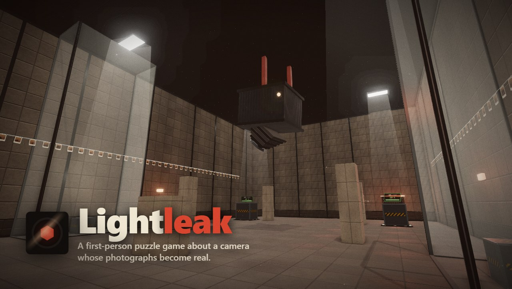</a>
</p>

<p align="center">
  <a href="https://github.com/jonahsaunders/lightleak/releases/latest"></a>
  
  
  
</p>

Photograph something and it goes onto your roll. Develop the photo, and a copy appears wherever you're looking, **at the size it looked in the picture**. Shoot a crate up close and develop it across the room, and it comes out enormous. Shoot a steel block from far away and develop it at your feet, and it fits in your pocket.

You wake up on the floor of a drying room, a print that came loose from the line. The archive's caretaker, the Curator, would very much like you back.

<p align="center">
  <a href="https://github.com/jonahsaunders/lightleak/releases/latest"><b>Download for Windows</b></a> &nbsp;·&nbsp;
  <a href="https://github.com/jonahsaunders/lightleak/releases/latest"><b>Browser version</b></a> &nbsp;·&nbsp;
  <a href="#run-it-from-source"><b>Run from source</b></a>
</p>

---

## The camera

<table>
  <tr>
    <td width="50%">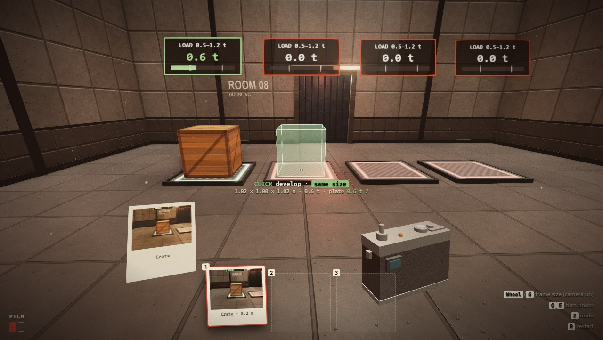</td>
    <td width="50%">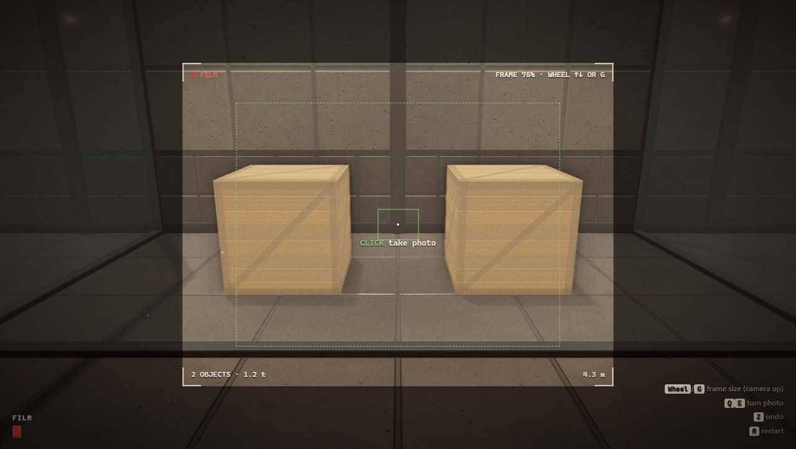</td>
  </tr>
  <tr>
    <td><b>Develop it somewhere else.</b> Hold up a photo and a ghost shows exactly what you'll get: its size, its weight, whether it'll fall, and what the plate below will read. Sizes snap to clean ratios, so "the same size" is easy to hit.</td>
    <td><b>Frame the shot.</b> Widen the frame and everything in it comes along in one photo, arranged just as you saw it. Photograph a whole staircase, not just a step.</td>
  </tr>
  <tr>
    <td width="50%">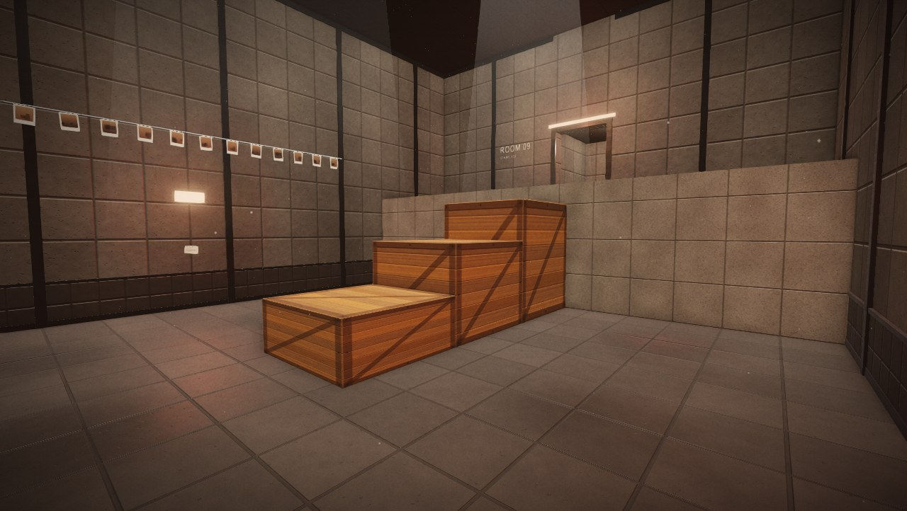</td>
    <td width="50%">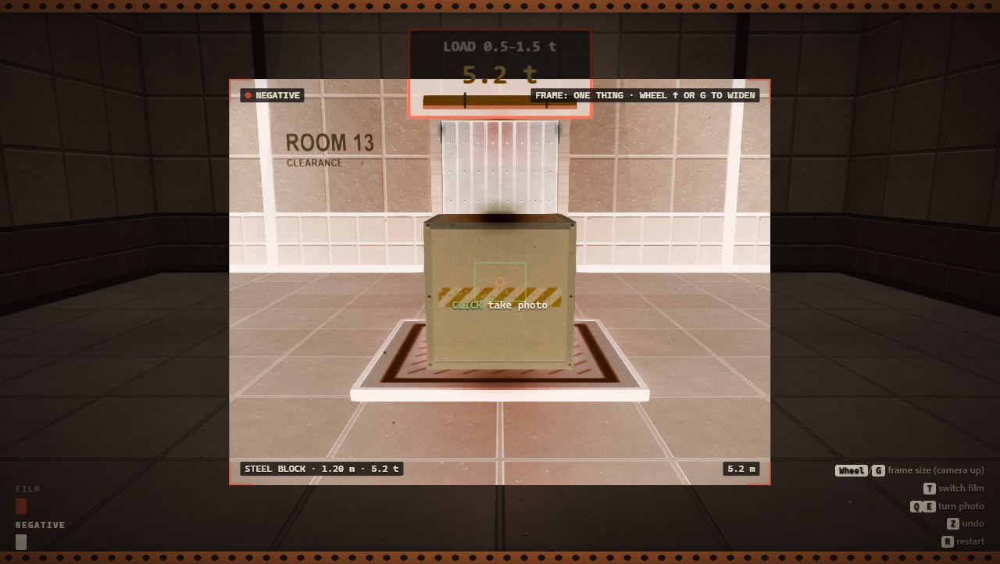</td>
  </tr>
  <tr>
    <td><b>Scale is the puzzle.</b> A model staircase in a glass case becomes the real thing. Distance makes things big, and distance makes them small.</td>
    <td><b>Negatives take things away.</b> Load negative film and whatever you develop dissolves: crates, steel, and the red emulsion that walls off parts of the archive.</td>
  </tr>
</table>

## The archive

<table>
  <tr>
    <td width="50%">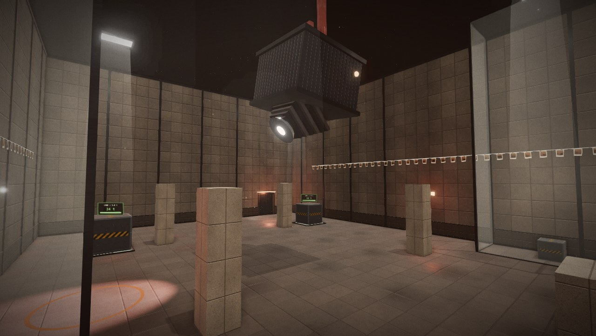</td>
    <td width="50%">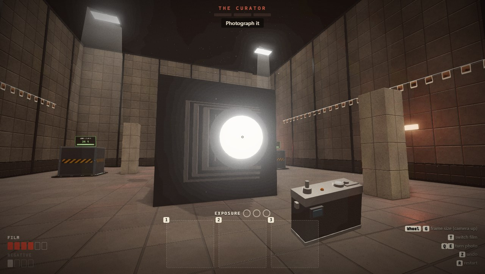</td>
  </tr>
  <tr>
    <td><b>The Curator</b> preserves things by photographing them. It preserved the staff, too. It talks you through its "calibration", and index cards on the walls tell you the rest.</td>
    <td><b>The last room</b> is its easel. Stay in the shadows it casts, load its counterweights, cut its straps, and then take its picture.</td>
  </tr>
  <tr>
    <td width="50%">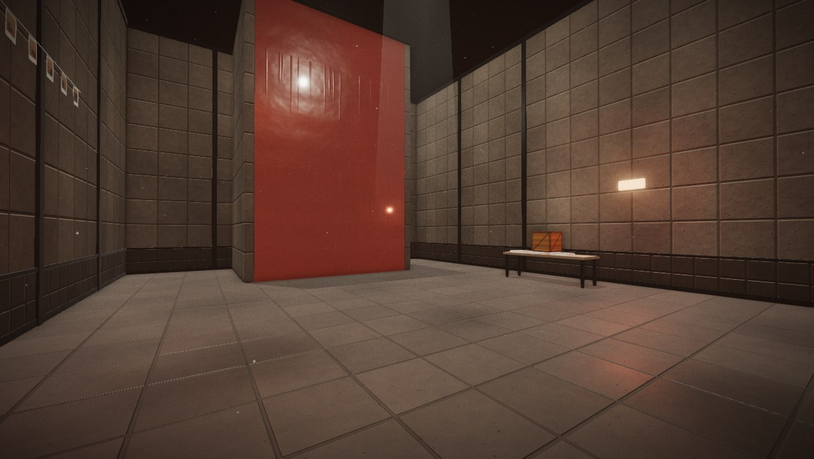</td>
    <td width="50%">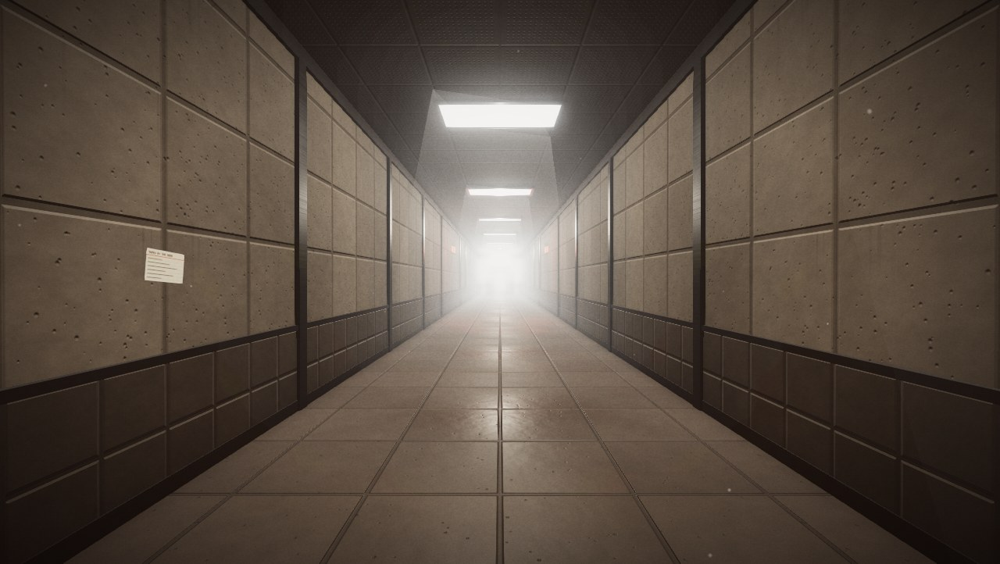</td>
  </tr>
  <tr>
    <td>Twenty-one rooms: a prologue, fifteen puzzles, a counterweight gallery, a safe light-inspection lesson, a changed return to the gallery, a final fight, and a way out.</td>
    <td>Every texture is painted in code and every sound is synthesised. There are no asset files at all.</td>
  </tr>
</table>

## Controls

| Keyboard and mouse | Gamepad | |
| --- | --- | --- |
| <kbd>W</kbd><kbd>A</kbd><kbd>S</kbd><kbd>D</kbd>, <kbd>Space</kbd> | Left stick, A | Move, jump |
| Hold <kbd>RMB</kbd> (or <kbd>F</kbd>), click | LT, RT | Raise the camera, take a photo |
| <kbd>Wheel</kbd> or <kbd>G</kbd> with the camera up | Bumpers, D-pad ↑↓ | Widen or narrow the frame |
| <kbd>1</kbd><kbd>2</kbd><kbd>3</kbd> or <kbd>Wheel</kbd>, click | Bumpers, RT | Hold up a photo, develop it |
| <kbd>Q</kbd><kbd>E</kbd> | D-pad ←→ | Turn the photo you're holding |
| <kbd>T</kbd> | X | Switch between film and negative |
| <kbd>Z</kbd> / <kbd>X</kbd> / <kbd>R</kbd> | B / Back | Undo / throw a photo away / restart the room |
| <kbd>H</kbd> | R3 | Progressive hint (also available from pause) |
| <kbd>Esc</kbd> / <kbd>F2</kbd> | Start | Pause / level editor |

The title screen has settings for sensitivity, field of view, invert look, five volume levels, reduced flashing, screen shake and subtitle size, plus High/Medium/Low graphics.

## How it plays

- **Fair by design.** Undo steps back through every shot. Falling puts you back to just after your last action. Nothing you do can leave a room unsolvable.
- **Stuck?** H, R3, or the pause-menu Hint button asks for a gentle hint, then a concrete one. The Curator also notices inactivity and repeated failed attempts; taking the same photograph repeatedly no longer postpones help. Hints are recorded in playtest sessions.
- **Physics you can read.** Stacks settle, overhangs tip, and weight matters: plates count everything resting on them, and some want a range, not just a minimum.
- **Between rooms,** the room you just solved develops into a print. Department signs, observation windows, and a shared overhead service rail connect the archive. The service gallery returns later with released portrait mounts and a changed atmosphere.
- **Machinery you can follow.** Copper lines connect scales to moving counterweights and shutters. Storage, restoration, exhibition, drying, and wet processing each have a distinct equipment sound.
- **Learn before danger.** The gallery demonstrates counterweights; a harmless inspection lamp teaches the same solid-cover/glass rule used by the Enlarger. The final fight combines these with the negative-film lessons.
- **Movement forgiveness.** Jump presses are buffered for 120 ms; a 100 ms grace period allows a jump just after stepping off a ledge. Narrow windows letterbox the game to preserve the camera framing.

---

## For developers

<p align="center">
  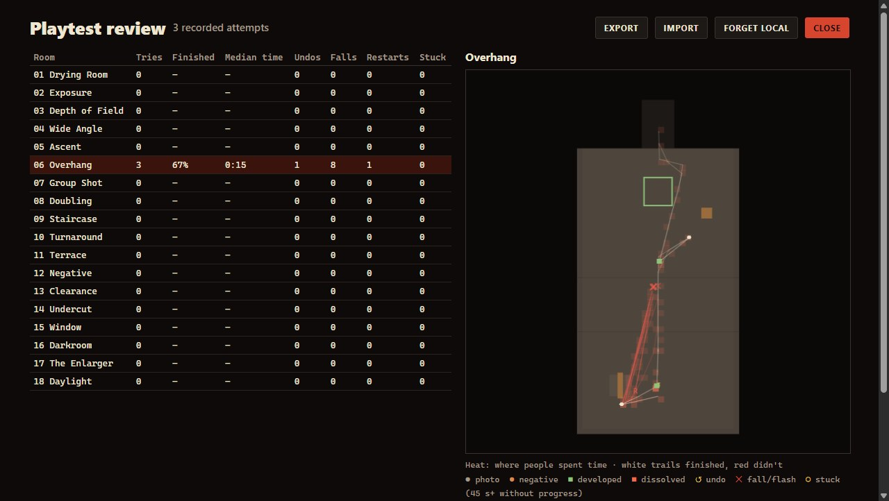
  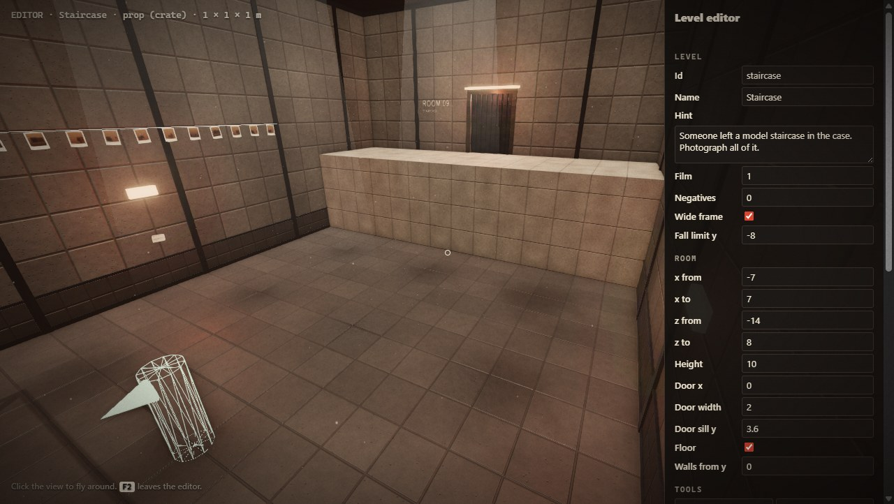
</p>

### Run it from source

```bash
npm install
npm run desktop
```

| Command | What it does |
| --- | --- |
| `npm start` | Serves the game at http://127.0.0.1:5178 |
| `npm run dev` | Same, and the editor saves levels and playtests save sessions as files |
| `npm run desktop` | Runs it as a desktop app (Electron) |
| `npm test` | Renderer-free checks using the live simulation: 21 solutions, 2 accepted alternatives, 9 blocked bypasses, 21 geometry audits, and hint/undo/light checks |
| `npm run test:desktop` | The same solution and geometry suite inside Electron, with the real renderer/materials |
| `npm run shots` | Re-renders the screenshots in this README |
| `npm run web` | Builds the static web version into `build/web` and `build/lightleak-web.zip` |
| `npm run dist` | Builds the Windows installer and portable `.exe` into `dist/` (`dist:mac` on a Mac) |

If npm holds back Electron's install script, run `node node_modules/electron/install.js` once.

### Playtesting

`npm test` requires only Node and the vendored runtimes. It uses real Rapier physics and Three geometry with canvas drawing omitted; it does not verify rendered pixels or audio. `npm run test:desktop` exercises the real browser setup. The movement changes can invalidate older input recordings; export those sessions before replacing them, and record fresh solutions for custom levels.


The most useful thing you can do with this game is watch people play it. Every attempt at a room is recorded automatically, including the full input stream, which replays exactly. **Playtest review** on the title screen shows each room's finish rate, median time, undos, falls, restarts and where people got stuck, over a top-down heatmap. **Watch** replays any attempt, and testers can **Export** their sessions for you to **Import**.

<details>
<summary><b>How the mechanics work</b></summary>

- **Scale.** A photo stores its objects, their arrangement and their distance from your eye (`d0`). Developing scales everything by `k = d / d0`, where `d` is the distance to where it lands, so it keeps its apparent size. Near a clean ratio (1, ½, 2, 3…) it snaps to it. The result stays between 0.15 m and 10 m overall.
- **Placement.** The photo develops against the surface under the crosshair and is nudged out of anything it clips. The ghost shows the result and, faintly, where it will land if it's going to fall.
- **Composition.** A widened frame takes everything inside it that the camera can see (glass is transparent to it; walls and emulsion aren't), keeping its arrangement relative to you.
- **Negatives.** A negative develops as a hole: every object it touches, and any emulsion, dissolves whole.
- **Physics.** Rapier simulates the objects. The player can't push them; they move only under gravity, so a puzzle can't be wrecked by accident.
- **Determinism.** The simulation runs at a fixed 60 Hz with a fixed field of view, so any recording replays exactly, whatever your settings.
- **The Enlarger.** Its lens follows you and throws a shadow-casting spotlight. It locks on (a red ring, a red lens) and flashes; if the lens can see you, you take a mark of exposure. Three marks rewind you, and they fade if you stay clear.

</details>

<details>
<summary><b>Making levels</b></summary>

Press **F2** in the game, or choose "Edit this level" from the pause menu.

- Click the view to fly (WASD, Space/Ctrl for up and down, Shift for speed). Esc frees the mouse for the panel.
- Number keys pick a tool: block, glass, emulsion, prop, plate, light panel, bench, spawn. LMB places, RMB selects, Delete removes, C copies a size, M cycles material or prop type, R turns it, and the wheel and `[ ] ; ' - =` resize. Ctrl+Z undoes.
- **Playtest** plays it; **Record solution** keeps your exact input as the level's solution; **Watch it** replays it; **Test** runs it headless.
- **Save** writes `levels/<id>.json` under `npm run dev` (new levels appear in a "Custom" chapter); otherwise it downloads the JSON.

Levels are JSON in `levels/`, in play order in `levels/index.json`: a `room` (walls, ceiling, and a door in the north wall), `blocks` (`mat`: ledge, wall, floor, dark, deep, glass, emulsion), `props` (crate, steel, plank), `plates` (`need`, optional `max`), `lights`, `decor` (benches, drying lines, index cards), `spawn`, `film` (`pos`, `neg`), `wide`, and `story`: the Curator's lines by event, including `nudge` and `nudge2` hints.

Each level carries a `solution`, either scripted steps (`walk`, `shoot`, `develop`, `wait`, `exit`) or a recorded `demo`, and can list `mustPass` alternative solutions plus `mustFail` shortcuts that must *not* finish it, such as jumping the Overhang gap without a plank.

</details>

<details>
<summary><b>How it looks</b></summary>

- **Materials** are painted in code as height, colour and roughness, with normal maps derived from the height. They tile seamlessly and are mapped in world space, so the one-metre panels line up across every surface and double as a ruler.
- **Architecture** is added to every room: wainscot and rail, baseboards, a cornice, pilaster ribs, a framed door with the room's name stencilled beside it, framed glass, recessed lights with soft shafts, and dust.
- **Rendering** runs through ambient occlusion, bloom, a filmic grade and SMAA, with reflections from a generated environment map.
- **No flicker.** Trim stands proud of walls, runs stop short at corners, decals sit off the wall, and `npm test` audits every level for coplanar faces a player could see.
- **Feel.** A camera in your hands with a working shutter, film lever and ejecting print, the photo you're holding in your other hand, footsteps that change with the surface, mechanical foley, room tone and a quiet generative score.

</details>

<details>
<summary><b>Project layout</b></summary>

| Path | What's there |
| --- | --- |
| `js/main.js`, `js/actions.js`, `js/simulation.js` | Boot, shared camera actions and fixed-step simulation, input, menus, level flow |
| `js/level.js`, `js/dressing.js` | Building levels, physics bodies, plates, doors, undo; architectural detail |
| `js/photo.js` | Framing, taking photos, placement, developing, negatives |
| `js/player.js` | The character controller |
| `js/hud.js`, `js/viewmodel.js`, `js/fx.js` | Viewfinder and readouts; the camera in your hands; develop and dissolve effects |
| `js/story.js`, `js/hints.js`, `js/boss.js` | The Curator's dialogue, progressive help and active-failure detection; the final fight |
| `js/archive.js`, `js/inspection.js`, `js/exposure.js` | Departments, observation windows, counterweights, and the shared light/cover lesson |
| `js/driver.js`, `js/audit.js` | Solution playback and the test runner; the z-fighting audit |
| `js/sessions.js`, `js/review.js` | Playtest recording and the review screen |
| `js/editor.js`, `js/settings.js`, `js/shots.js` | The level editor; player settings; README screenshots |
| `js/materials.js`, `js/post.js`, `js/audio.js` | Procedural textures; post-processing; synthesised sound |
| `server.js`, `desktop/main.js`, `tools/` | Local server, the Electron wrapper, the web build and icon generator |

</details>

<details>
<summary><b>Publishing to itch.io</b></summary>

Run `npm run web` and upload `build/lightleak-web.zip` as an HTML project with "This file will be played in the browser" ticked. A 1280×800 viewport works well; turn on the fullscreen button. Upload the Windows builds from `dist/` alongside it.

</details>

<details>
<summary><b>Known gaps</b></summary>

- It needs playtesting by real people. The scripted solutions prove every room can be solved, not that it's fun or fair; the recording and review tools are there to find out.
- Mouse feel, jump height and reach were tuned by numbers, not by hand.
- Room lights other than the Curator's have no shadows, so a lamp can light the far side of a thin wall.

</details>

## Originality

The idea of a camera that copies objects into photos was explored in a cancelled Valve prototype. Game mechanics aren't protected by copyright, but specific expression is, so this project is written from scratch and takes nothing from that work or from the Portal series: no Valve code, assets, names, characters, setting, sounds or leaked material. The setting, story, characters, dialogue, puzzles, art direction, UI and name are original. The look is a darkroom (warm concrete, dark steel, red safelights), deliberately unlike Portal's white panels and orange and blue, and the story is about photographs and copies rather than testing. It follows a genre shape many games share (a lone survivor in a facility, a guiding voice with its own agenda, a final confrontation), and none of Portal's specifics: no sarcastic AI, cake, turrets or cubes.

Textures are drawn at runtime, sounds are synthesised, and the icon is generated by `tools/icon.js`. Third-party code (three.js and Rapier) is listed in [LICENSES.md](LICENSES.md). If you take this further commercially, don't market it by reference to Valve's project or Portal, and check that the name "Lightleak" is clear to trademark where you'll sell it.

